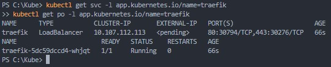

# Kubernetes
## Requirement
- **Computer**
  - 2 CPUs or more
  - 2GB of free memory
  - 20GB of free disk space
  - Internet connection
  - Container or virtual machine manager, such as: 
    * Docker
    * QEMU
    * Hyperkit
    * Hyper-V
    * KVM
    * Parallels
    * Podman
    * VirtualBox
    * VMware Fusion/Workstation
## Wakatime
***Url*** -> https://wakatime.com/@spcn23/projects/wrufjrnlpt
## Step
### 1. Install kubectl and minikube

1. #### install kubectl 
    Use **curl** to insatll
   ``` 
   curl.exe -LO "https://dl.k8s.io/release/v1.26.0/bin/windows/amd64/kubectl.exe"
   ```
     \
    Test command
   ```
   kubectl version --client
   ```
     


2. #### Insatll minikube
    Download and run the install
    ```
    New-Item -Path 'c:\' -Name 'minikube' -ItemType Directory -Force
    Invoke-WebRequest -OutFile 'c:\minikube\minikube.exe' -Uri 'https://github.com/kubernetes/minikube/releases/latest/download/minikube-windows-amd64.exe' -UseBasicParsing
    ```
     \
    Add the minikube.exe binary to your PATH
    ```
    $oldPath = [Environment]::GetEnvironmentVariable('Path', [EnvironmentVariableTarget]::Machine)
    if ($oldPath.Split(';') -inotcontains 'C:\minikube'){ `
    [Environment]::SetEnvironmentVariable('Path', $('{0};C:\minikube' -f $oldPath), [EnvironmentVariableTarget]::Machine) `
    }
    ```


     
    >:warning:**_WARNING:_**
    Must run as Administrator 


    Test command
    ```
    minikube version
    ```

     


3. #### Start minikube
    ```
    minikube start
    ```

     


    >:memo:**_NOTE:_**
    You can user another driver to run minikube such as: Hyper-V,VirtualBox,VMware or anything else
    *Usage:* ```minikube start --driver=<driver>``` \
    Or make as the default driver: ```minikube config set driver <driver>```
    

### 2. Install traefik
1. #### Install Traefik Resource Definitions
    ```
    kubectl apply -f https://raw.githubusercontent.com/traefik/traefik/v2.9/docs/content/reference/dynamic-configuration/kubernetes-crd-definition-v1.yml
    ```
     

    
1. #### Install RBAC for Traefik
   ```
   kubectl apply -f https://raw.githubusercontent.com/traefik/traefik/v2.9/docs/content/reference/dynamic-configuration/kubernetes-crd-rbac.yml
   ```
     


3. #### Install Traefik Helmchart
   >:warning:**_WARNING:_**
    Must be install **[helm](https://get.helm.sh/helm-v3.11.2-windows-amd64.zip)** and add the helm.exe binary to your **PATH ENVIRONMENT**
    or following the step here **[click](https://helm.sh/docs/intro/install/)**
    ```
    helm repo add traefik https://traefik.github.io/charts 
    helm repo update 
    helm install traefik traefik/traefik 
    ```
     


4. #### Verify service is running
    ```
    kubectl get svc -l app.kubernetes.io/name=traefik
    kubectl get po -l app.kubernetes.io/name=traefik
    ```
     


### 3. Create secrete
```
htpasswd -nB user | tee auth-secret
# New password:
# Re-type new password:
# Example output user:$2y$05$W4zCVrqGg8wKtIjOAU.gGu8MQC9k7sH4Wd1v238UfiVuGkf0xfDUu
```
 


### 4. Dry run to create a secret deployment.
```
kubectl create secret generic -n traefik dashboard-auth-secret --from-file=users=auth-secret -o yaml --dry-run=client | tee dashboard-secret.yaml
```
 \
This will automatic create a deployment file dashboard-secret.yaml
Copy users secret from dashboard-secret.yaml and replace in traefik-dashboard.yaml

>:warning:**_WARNING:_** 
you must run **```minikube dashboard```** for get cluster dashboard
and **```minikube tunnel```** for route to services

### 5. Deploy
```
kubectl apply -f . 
```
 

>:warning:**_WARNING:_**
If you following this step, you must add
**127.0.0.1 traefik.spcn23.local web.spcn23.local**
to your host file on your computer


## Result 

Use **http://127.0.0.1:2287/api/v1/namespaces/kubernetes-dashboard/services/http:kubernetes-dashboard:/proxy/** for cluster dashboard \
 \
Use **https://traefik.spcn23.local/dashboard/** for traefik dashboard \
 \
Use **http://web.spcn23.local/** for cancher web \
 
